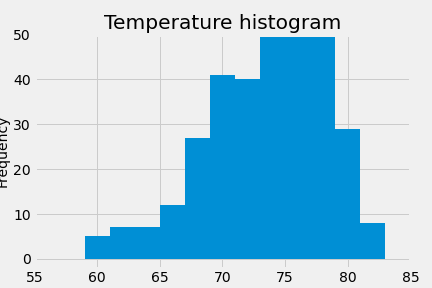

# A look into SQLalchemy

Congratulations! You've decided to treat yourself to a long holiday vacation in Honolulu, Hawaii! To help with your trip planning, here is some climate analysis on the area. 

## Step 1 - Climate Analysis and Exploration

We will be using Python, SQL Alchemy and a sqlite file for this analysis. You can find the dataset (hawaii.sqlite) in the [Resources](Resources) directory and the code Climate Analysis and Exploration.ipynb in the [Analysis](Analysis) directory.

### Precipitation Analysis

We start this analysis with figuring out the most recent date of our data. From here we are able to see the precipiation levels for the final 12 months of the data. These numbers are represented below with a bar chart.

With the precipitation data, we also performed a summary statistical description.

### Station Analysis

After performing the precipitation analysis, we looked into the data of the individual stations. First, we calculated the count of temperature measurements performed by each station and concluded that Station ID USC00519281 had the most. From there we analyzed the minimum, maximum and average temperature for station USC00519281.

Below is a histogram chart showing the frequency of temperature observations within station USC00519281.

## Step 2 - Climate App

 With the introduction of SQL Alchemy, we also are introducing flask through Python and creating our own API. This file is also in the [Analysis](Analysis) directory in app.py. This file must be run while in the Resources directory. 

### Routes

From the home page, you can access five different routes

1. Precipitation levels between 8/23/2016 and 8/23/2017
2. List of stations
3. Temperature observations for station USC00519281 for each day between 8/23/2016 and 8/23/2017
4. The minimum, maximum and average temperature for a date range where you pick any start date between 1/1/2010 and 8/22/2017 untl the end date 8/23/2017 
5. The minimum, maximum and average temperature for any date range you choose between 1/1/2010 and 8/23/2017

